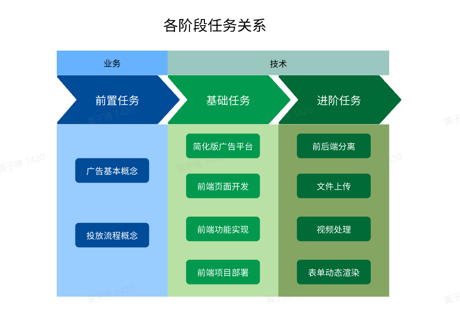
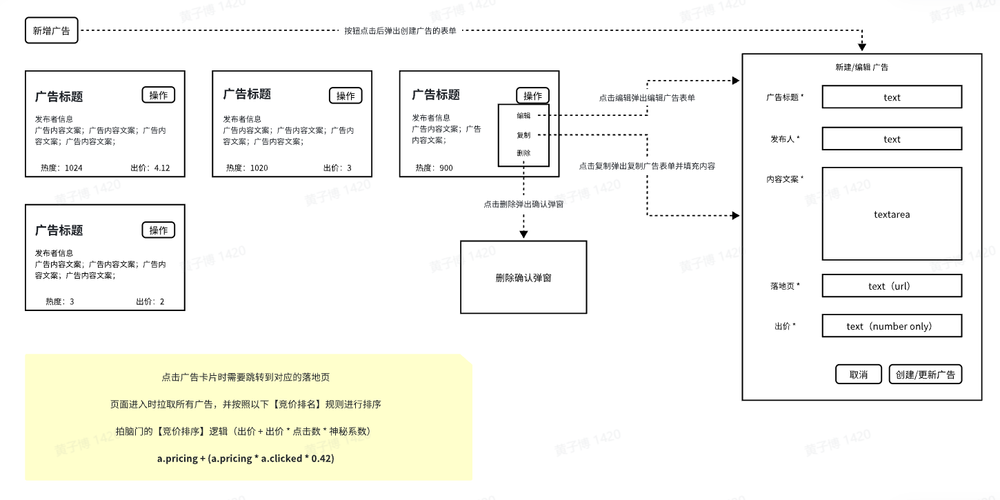
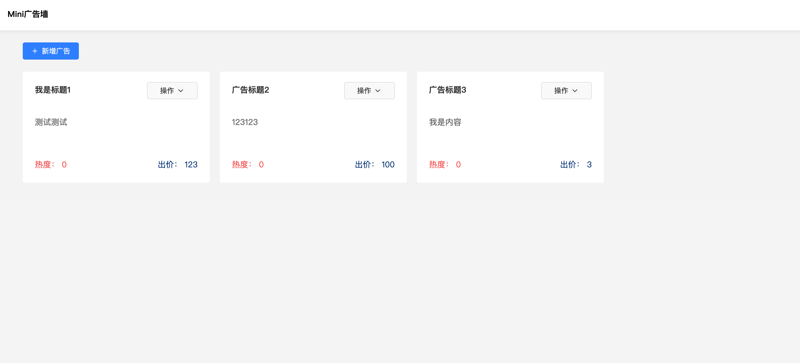
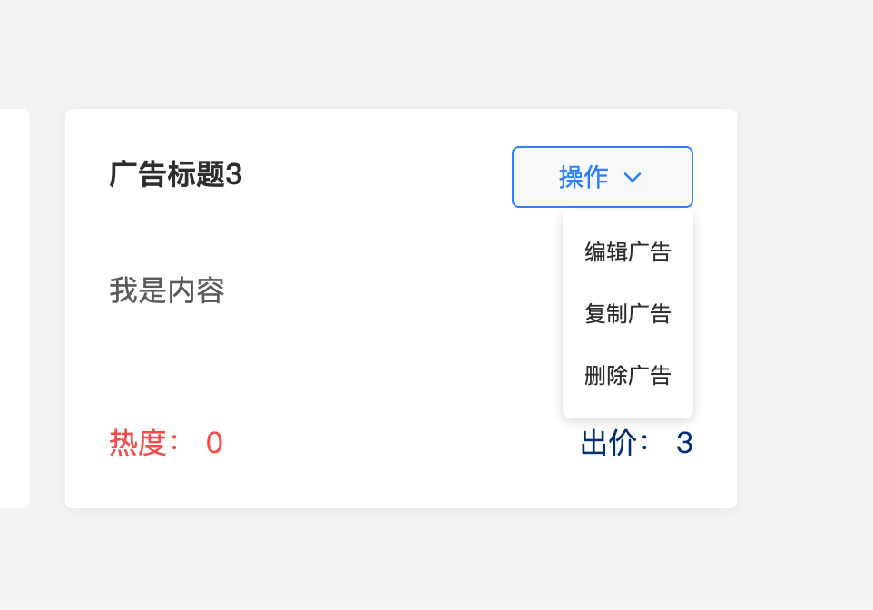
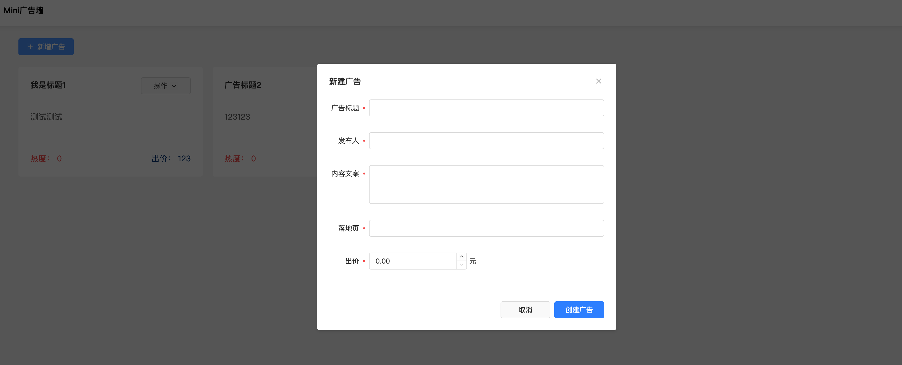
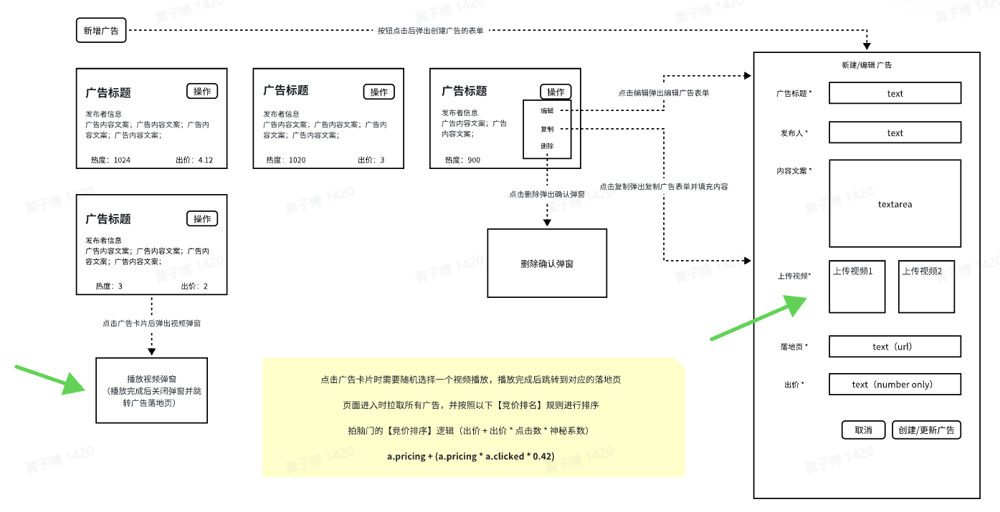

## 中国商业产品与技术 - 前端训练营课题作业

### 项目名称

实现一个极简版的广告平台——mini广告墙

### 项目要求

项目需由单人独立完成，核心业务逻辑自行实现，可在局部功能中使用第三方库，并允许借助 Cursor/Trae 等 AI 编辑器。

### 项目节奏

- 明确任务范围并完成技术选型
- 完成项目框架搭建，确定广告墙数据结构
- 完成纯前端版本的 mini 广告墙
- 如有余力，完成 3 项进阶任务，完成度越高越受导师青睐

### 项目内容概览

| 阶段       | 项目内容                                 | 目的                                                         |
| ---------- | ---------------------------------------- | ------------------------------------------------------------ |
| 前置任务   | 广告知识学习                             | 了解广告系统基础，体验真实广告系统，为 mini 广告墙打基础    |
| 基础任务   | 完成纯前端版本的 mini 广告墙             | 构建纯前端页面，展示广告列表并实现 CRUD、点击排序等功能     |
| 进阶任务 1 | 完成前后端分离版本的 mini 广告墙         | 改造成前后端分离形态，开发后端 CRUD 服务并完善整体架构       |
| 进阶任务 2 | 增加视频上传和播放功能                   | 掌握文件上传、视频播放等高级前端场景                        |
| 进阶任务 3 | 将广告创建表单改为动态渲染               | 从后端读取表单配置并动态渲染，提升动态化表单开发能力        |



---

## 前置任务：广告知识学习

**任务目标**：学习广告相关基础知识，体验真实广告系统，为制作 mini 广告墙打基础。

**学习资料**：

- [计算广告基本概念入门](https://juejin.cn/post/6976842782082072584)
- [互联网广告系统的那点事情](https://juejin.cn/post/7313822358456172570)
- [干货 \| 广告系统架构解密](https://juejin.cn/post/6904481406013931533)
- [构建高效的广告投放系统：应用架构的设计与实现](https://juejin.cn/post/7342315772303081487)

---

## 基础任务：纯前端版 mini 广告墙

目标：实现纯前端广告墙，包含展示列表、创建/编辑/复制/删除广告以及点击后实时出价排序等功能。

**原型稿**：









### 名词解释

| 名词       | 说明                                                         | 示例                                                         |
| ---------- | ------------------------------------------------------------ | ------------------------------------------------------------ |
| 广告标题   | 广告名称                                                     | 巨量引擎                                                     |
| 发布者信息 | 广告发布者                                                   | 字节广告君                                                   |
| 内容文案   | 广告推广文案                                                 | 巨量引擎是字节跳动旗下综合的数字化营销服务平台...（略）      |
| 落地页     | 落地页 URL（营销活动专用页面）                               | <https://www.oceanengine.com/>                                 |
| 出价       | 广告计划设置的出价，表示愿意为每次展示支付的费用             | 5.00                                                         |
| 热度       | 点击次数                                                     | 1                                                            |
| 编辑/复制  | 对应的广告操作                                               | -                                                            |
| 竞价排名   | 通过出价竞争获得排名的机制，点击价高者排名靠前且未点击不计费 | 排名逻辑：出价 + 出价 × 点击数 × 0.42（神秘系数 0.42）      |

### 核心流程

1. **页面进入/刷新广告列表**：拉取所有广告 → 按竞价排名排序 → 展示。
2. **创建广告**：点击新增 → 填写表单 → 校验 → localStorage 落库 → 成功提示 → 刷新列表。
3. **编辑广告**：点击编辑 → 修改表单 → 校验 → localStorage 更新 → 成功提示 → 刷新列表。
4. **复制广告**：点击复制 → 携带目标广告数据 → 填写 → 校验 → 落库 → 成功提示 → 刷新列表。
5. **删除广告**：点击删除 → 确认 → 删除数据 → 成功提示 → 刷新列表。
6. **点击广告**：点击卡片 → 新开落地页 → 点击数 +1 并落库 → 刷新列表。

> 说明：纯前端版本的 “落库” 指将数据存入 `localStorage`。

---

## 进阶任务

### 任务 1：前后端分离版 mini 广告墙

目标：将纯前端页面改造成前后端分离，并完成后端服务开发。

**后端需至少实现接口**：

- 创建广告
- 编辑广告
- 删除广告
- 查询广告列表
- 点击次数 +1

**流程变化**：

1. 页面进入/刷新：请求广告列表接口 → 竞价排序 → 展示。
2. 创建广告：新增弹窗 → 填写 + 校验 → 请求创建接口 → 成功提示 → 刷新。
3. 编辑广告：编辑弹窗 → 修改 + 校验 → 请求更新接口 → 成功提示 → 刷新。
4. 复制广告：复制弹窗 → 携带旧数据 → 编辑 + 校验 → 请求创建接口 → 成功提示 → 刷新。
5. 删除广告：删除确认 → 请求删除接口 → 成功提示 → 刷新。
6. 点击广告：打开落地页 → 请求点击 +1 接口 → 刷新列表。

### 任务 2：增加视频上传与播放

为广告增加多视频上传及播放能力，参考改版原型：



### 任务 3：广告创建表单动态渲染

目标：从后端获取表单配置（JSON）并动态渲染表单项。

**改造思路**：

1. 后端新增表单配置接口。
2. 使用 JSON 描述表单配置，例如：

```json
[
  { "field": "title", "name": "广告标题", "component": "Input", "validator": { "maxCount": 10 } },
  { "field": "author", "name": "发布人", "component": "Input", "validator": { "maxCount": 10 } },
  { "field": "url", "name": "落地页", "component": "Input", "validator": { "url": true } },
  { "field": "price", "name": "出价", "component": "Input", "validator": { "number": true } }
]
```

3. 前端通过 JSON Schema（或自定义 Schema）动态渲染表单项并校验。
4. 示例流程：点击新增 → 请求表单配置 → 按配置渲染 → 填写 → 按配置校验 → 请求新建接口 → 成功提示 → 刷新列表。

---

## 提交产物

1. 开发文档（含技术选型、架构设计、复杂逻辑细节等）。
2. 项目源代码。
3. 可外网访问的项目链接。

---

## FAQ

- **技术栈如何选择？** 推荐使用 Vue 或 React + TypeScript；后端可选 express、koa、Next.js 等。
- **进阶任务一定要做吗？** 建议完成 1-2 项，如有余力可全部完成，完成度越高越好。
- **可以使用 AI 吗？** 可以，但需确保生成代码质量。
- **可以使用第三方库吗？** 可以在局部能力中使用，核心功能需自行实现，并在文档内说明。
